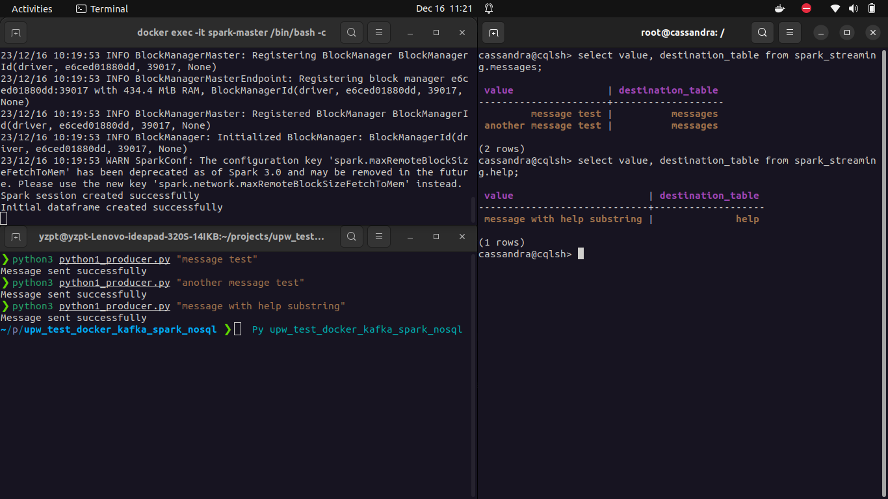

To do:
- [ ] Kafka ACL authentification

<hr>




* journal.sh:

```bash
# docker
docker compose down
docker compose up -d

# venv
python3 -m venv venv
source venv/bin/activate

# pip
pip install kafka-python
pip install pyspark


# === Kafka ========================================================================
# create topic
topic=test-topic
server=kafka:9092

# create topic
docker exec kafka opt/bitnami/kafka/bin/kafka-topics.sh --create --topic $topic --bootstrap-server $server
# kafka consumer
docker exec kafka opt/bitnami/kafka/bin/kafka-console-consumer.sh --topic $topic --from-beginning --bootstrap-server $server
# kafka producer
docker exec kafka opt/bitnami/kafka/bin/kafka-console-producer.sh --topic $topic --bootstrap-server $server

# py produce message on kafka
python3 python1_producer.py "message content"

# py consume message on kafka
python3 python2_consumer.py


# === Spark ========================================================================


docker compose down  spark-master spark-worker
docker compose up -d spark-master spark-worker  
# start streaming:
docker exec -it spark-master /bin/bash -c "spark-submit --master local --packages org.apache.spark:spark-sql-kafka-0-10_2.12:3.4.1,com.datastax.spark:spark-cassandra-connector_2.12:3.4.1 /opt/bitnami/pyspark_scripts/spark_streaming.py"

# ok


# === Cassandra ========================================================================
# connect to cassandra container
docker exec -it cassandra /bin/bash

# connect to cassandra
cqlsh -u cassandra -p cassandra

# create keyspace
CREATE KEYSPACE spark_streaming WITH replication = {'class':'SimpleStrategy','replication_factor':1};

# drop table
DROP TABLE spark_streaming.help;
DROP TABLE spark_streaming.messages;

# create help table
CREATE TABLE spark_streaming.help(
    id uuid PRIMARY KEY,
    content text,
    value text,
    timestamp text,
    destination_table text
);

# create messages table
CREATE TABLE spark_streaming.messages(
    id uuid PRIMARY KEY,
    content text,
    value text,
    timestamp text,
    destination_table text
);

select value, destination_table from spark_streaming.help;
select value, destination_table from spark_streaming.messages;

truncate spark_streaming.help;
truncate spark_streaming.messages;

# data insertion ok !

# === SASL ========================================================================

```
